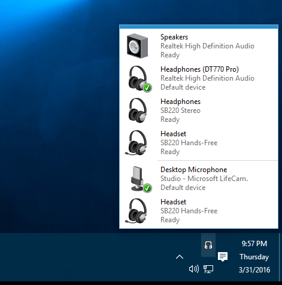

Audio Switcher
==============

Audio Switcher is a simple app that runs in the notification area (system tray) and lets you easily switch the default input and output audio devices.

Tired of having to perform a song and dance through the Windows Sound dialogs just to switch from your speakers to your headphones? Then this app is for you.

## How do I install this thing?
Currently, there is no installer or binary that you can run or download. You'll need to build the project yourself. Open the solution in Visual Studio 2013, build and then run `AudioSwitcher.exe` from the bin directory.

## Acknowledgements
Ian van der Linde ([@Ianvdl](http://github.com/ianvdl))
* [#4](https://github.com/davkean/audio-switcher/issues/4): Provided the headphones tray icon

Abdallah Gomah ([@Abdallah-Gomah](http://www.codeproject.com/Members/Abdallah-Gomah))
* Provided the code to [extract large icons from native resources](http://www.codeproject.com/Articles/32617/Extracting-Icons-from-EXE-DLL-and-Icon-Manipulatio)

NAudio (http://naudio.codeplex.com/)
* Provided the original code to manipulate and query the Windows Core Audio API

